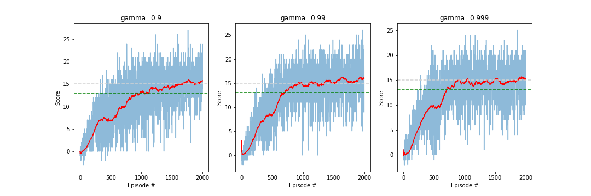
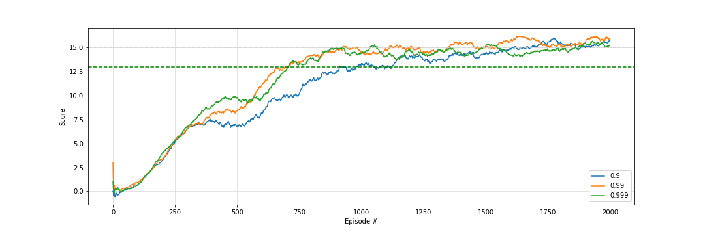
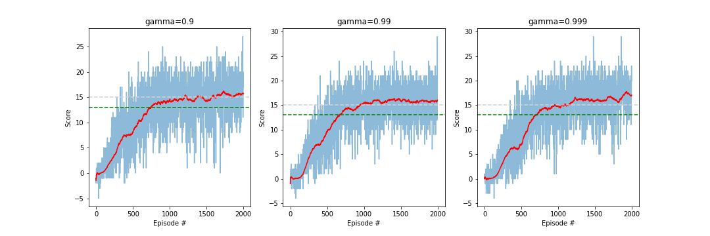
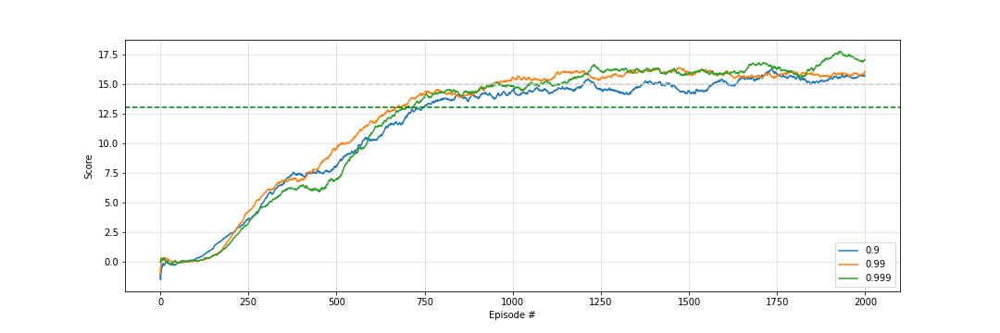
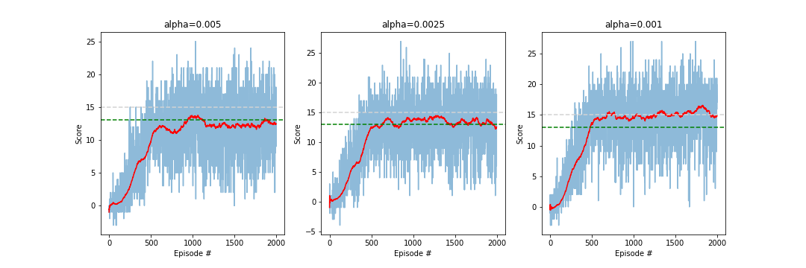
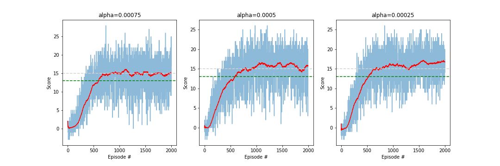
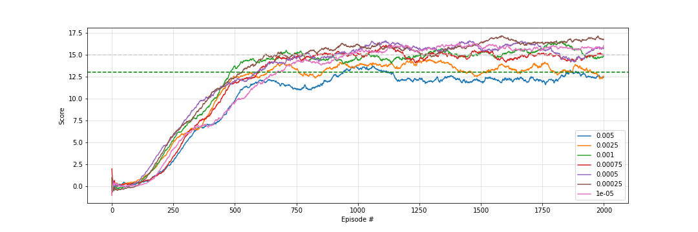

# Learning Algorithm 
I implemented a Deep Q Network (DQN) algorithm for this project as described in this [paper](https://www.nature.com/articles/nature14236) by google researchers. This implementation uses a soft-update for the target network and a less complex neural network architecture without convolution layers. They are not needed, because no raw image pixel data are used for input to train the DQN. The Neural Network architecture for the DNNs of the DQN consists of two fully connected hidden layers with ReLU activation function. 

# Results

Initially I started with the following hyper-parameters. 

```
dqn hyperparameters:
epsilon [decay 0.995, min 0.01, start 1.0], gamma: {0.9, 0.99, 0.999}
tau 0.001, buffer size: 100000, batch size: 64, update every: 4
alpha 5e-05, hidden layer 1 scalar: 1, hidden layer 2 scalar: 1
 ========================================
 features: [Input: 37, Layer 1: 37, Layer 2: 37, output: 4 ]
 features: [Input: 37, Layer 1: 37, Layer 2: 37, output: 4 ]
```
I tested these hyper-parameters with gamma values of {0.9, 0.99, 0.999} over 2000 episodes and two hidden layer with the size of the input layer (37). Results:

 

The agent with a gamma of 0.9 solved the environment (average score of 13 over 100 episodes) after 912 episodes. The agents with a gamma of 0.99 and 0.999 solved the environment after 704 and 707 episodes, while the agent with a gamma 0.99 reaches the highest maximum average score.  

I repeated the same test and doubled the size of the hidden layers to 74. 
```
dqn hyperparameters:
epsilon [decay 0.995, min 0.01, start 1.0], gamma: {0.9, 0.99, 0.999}
tau 0.001, buffer size: 100000, batch size: 64, update every: 4
alpha 5e-05, hidden layer 1 scalar: 2, hidden layer 2 scalar: 2
 ========================================
 features: [Input: 37, Layer 1: 74, Layer 2: 74, output: 4 ]
 features: [Input: 37, Layer 1: 74, Layer 2: 74, output: 4 ]
```
Results:

 

The network with the larger hidden layer size performs better on all gamma values. The environment is solved earlier and the agents look more stable. The agent with a gamma of 0.99 solved the environment after 668 episodes, for a gamma of 0.9 after 744 episodes and for a gamma of 0.999 after 699 episodes. 
The agent with a gamma of 0.999 reached the highest maximum average score of 17.73.

Nevertheless, I decided to fix gamma at 0.99 and tried 6 more learning rates (alpha). 
I tested the additional alpha values of {0.005, 0.0025, 0.001, 0.00075, 0.0005, 0.00025}

Results:


 

The agent with a alpha of 0.001 solved the environment after 481 episodes. But the agent with a gamma of 0.00025 performed better over all episodes. It solved the environment after 524 episodes and after around 800 episodes, it stayes stable over a average score of 15 and reached a maximum average score of 17.19.
The hyper-parameter of the agent:
```
dqn hyperparameters:
epsilon [decay 0.995, min 0.01, start 1.0], gamma: 0.99
tau 0.001, buffer size: 100000, batch size: 64, update every: 4
alpha 0.00025, hidden layer 1 scalar: 2, hidden layer 2 scalar: 2
 ========================================
 features: [Input: 37, Layer 1: 74, Layer 2: 74, output: 4 ]
 features: [Input: 37, Layer 1: 74, Layer 2: 74, output: 4 ]
 ```
## Ideas for Future Work
For further improvement, the hyper-parameters could be further optimized. In addition a prioritized experience replay could be used for the replay buffer and would eventually improve the performance.
One could also implement a Double Deep Q Network or a Dueling Deep Q Network to eventually improve the agents performance.